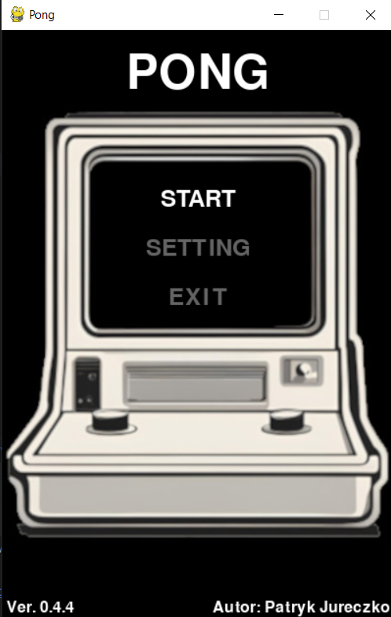
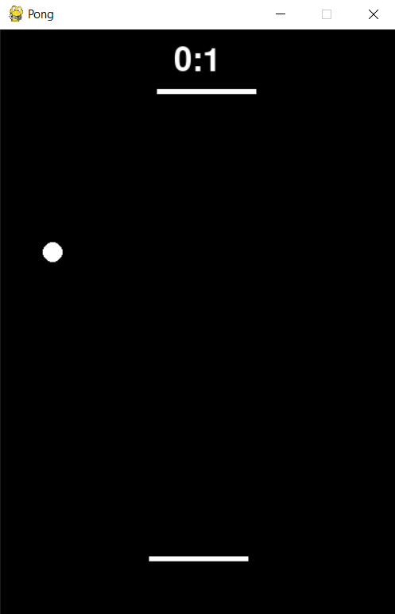
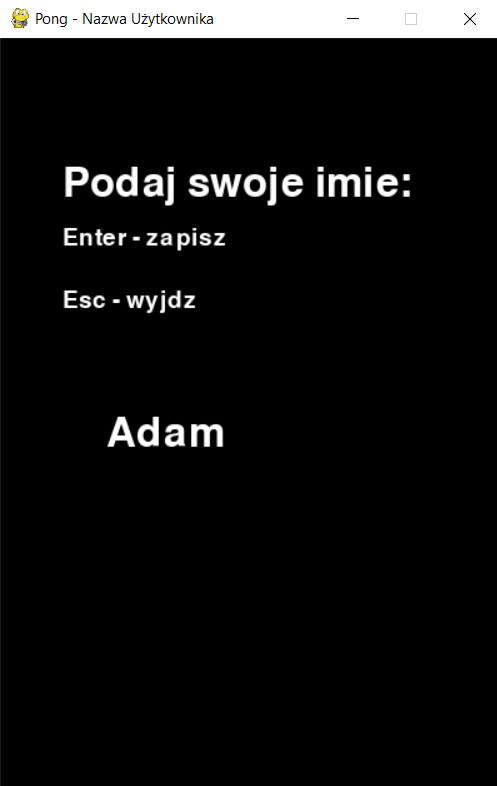
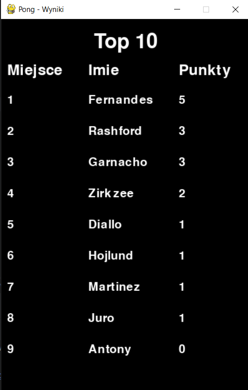

# Pong - Python Version

## Opis

To prosta wersja klasycznej gry Pong, zaimplementowana w języku Python przy użyciu biblioteki OpenCV. Gra zawiera tryb gry w którym jedna sterowana przez gracza, druga przez komputer. Piłka odbija się między paletkami i ścianami, a celem jest zdobycie punktów przez przepuszczenie piłki obok paletki przeciwnika. Co 5 punktów zdobytych przez gracza poziom trudności się zwiększa.

## Menu

## Funkcje

- Dwie paletki: jedna sterowana przez gracza, druga sterowana przez komputer.
- Odbijająca się piłka z wykrywaniem kolizji z paletkami i ścianami.
- Prosty system punktacji, który śledzi punkty gracza i komputera.
- Proste menu startowe z możliwością rozpoczęcia gry, wejścia w ustawenia oraz zakończenia zabawy
- 3 poziomy trudności 'easy', 'medium' i 'hard' do wyboru z poziomu ustawień
- Możliwość zapisania swoich wyników wpisując z klawiatury swoją nazwę
- Tabela Top 10 najlepszyhc wyników

## Screenshot

## Wymagania

Aby uruchomić grę, potrzebujesz zainstalowanego Pythona 3 oraz następujących biblioteki Pygame

## Jak uruchomić

Uruchom plik main.py. Gra rozpocznie się od ekranu menu.

## Sterowanie

Wybierz opcję Start i zatwierdź enterem, aby rozpocząć grę. 
Użyj klawisza A, aby przesunąć dolną paletkę w lewo. 
Użyj klawisza D, aby przesunąć dolną paletkę w prawo. 
Naciśnij Esc w dowolnym momencie, aby zakończyć grę. 
Wpisz z klawiatury swoje imie aby zapisać wynik i zatwierdź enterem 

## Zapisywanie wyniku

## Cel gry:

Kontroluj paletkę, aby utrzymać piłkę w grze. 
Celem jest zdobycie punktów, przepuszczając piłkę obok paletki przeciwnika. 

## Top 10

## Autor

**Patryk Jureczko**
Wersja: 0.4.4